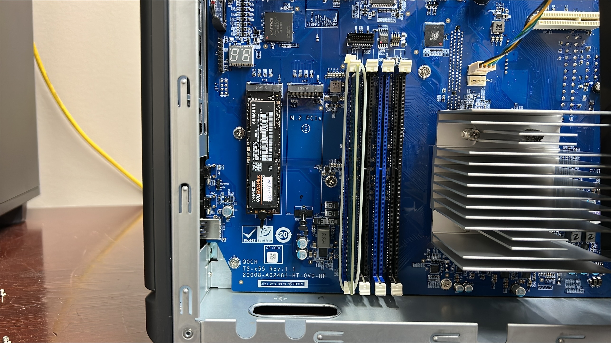
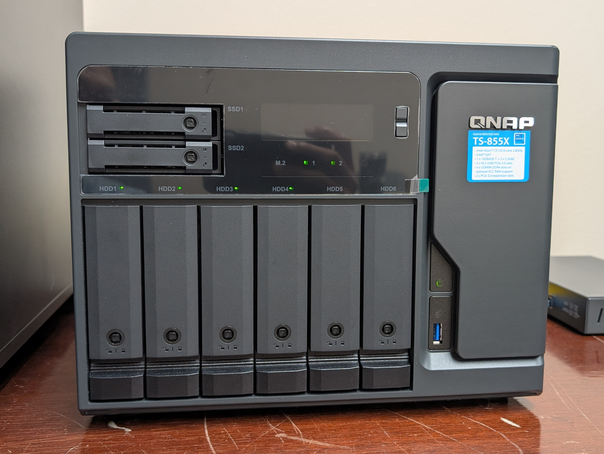

I recently installed two Samsung 970 EVO Plus 1TB NVMe drives into our QNAP TS-855X NAS as a read/write cache layer. The result: write speed jumped from 169 MB/s to 673 MB/s — nearly 4×.

{/* truncate */}

## Why We Needed This

Our HPC cluster shares a single NFS `/home` across both nodes over 10GbE. The NAS itself was already fast on reads (~1.2 GB/s, limited by the 10GbE link), but writes were the bottleneck — 169 MB/s is slow when users are saving checkpoints, logging training runs, or syncing large datasets. The QNAP TS-855X has two M.2 PCIe slots on the motherboard, so adding NVMe cache was the natural next step.

## The Hardware

- **NAS**: QNAP TS-855X-8G-US
- **Drives**: 2× Samsung 970 EVO Plus 1TB (M.2 PCIe)
- **Cache config**: Read Cache (RAID 0, 1.73 TB) + ZIL Synchronous Write Log (RAID 1, ~10 GB mirrored)

## Installation

The physical installation was straightforward — the QNAP TS-855X has two M.2 PCIe slots directly on the motherboard, accessible by opening the side panel. Slot 1 was empty; I installed the first drive there, then the second in slot 2.

Once both drives were seated, I powered the NAS back on. The front panel confirmed both M.2 slots were recognized — both indicator lights lit up green:

Then I configured the cache in **Storage & Snapshots → Cache Acceleration**:

- **Read cache**: both drives in RAID 0 for maximum read throughput
- **ZIL write log**: a small mirrored partition across both drives to accelerate synchronous writes safely

## Results

The difference was immediately measurable:

| | Before NVMe cache | After NVMe cache |
|---|---|---|
| **Write** | 169 MB/s | **673 MB/s** |
| **Read** | 1.2 GB/s | 1.2 GB/s (10GbE limited) |

Read speed didn't change — it was already hitting the 10GbE ceiling (~1.25 GB/s). But write speed went from a bottleneck to genuinely comfortable for our workloads. Checkpoint saves and rsync transfers all feel noticeably snappier.

## One Thing to Know

:::warning
Never physically remove the NVMe drives while cache is active — even with the NAS powered off, this risks data loss. To safely remove them, first disable the cache in the QNAP UI and wait for it to fully flush before powering down.
:::

## Worth It?

For a NAS serving as shared NFS storage for an HPC cluster, absolutely. The Samsung 970 EVO Plus drives are relatively affordable, the installation took under 30 minutes, and the write speed improvement is significant for our day-to-day workloads. If your NAS has empty M.2 slots, this is one of the easiest upgrades you can make.
