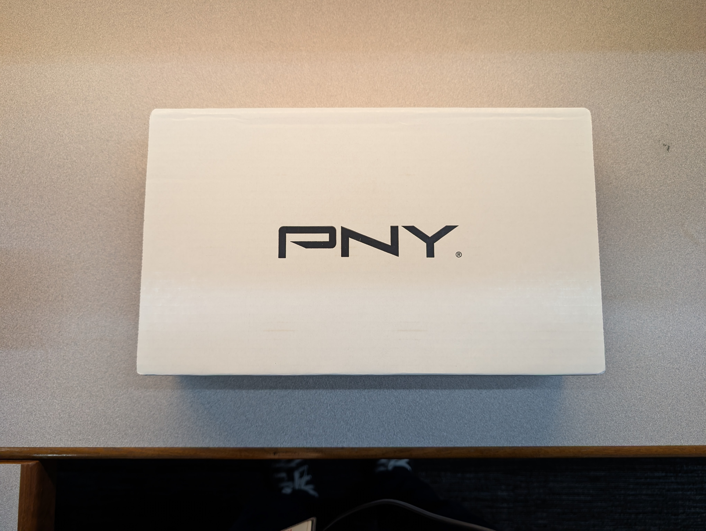
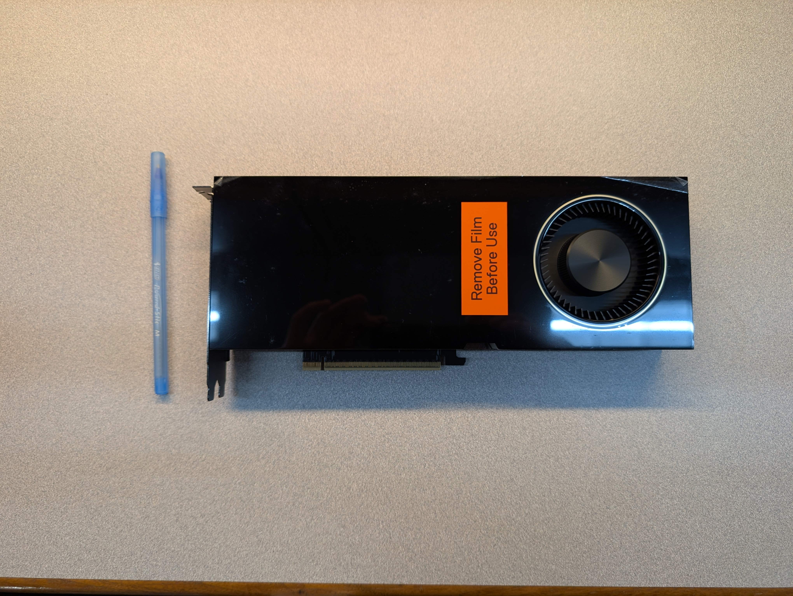
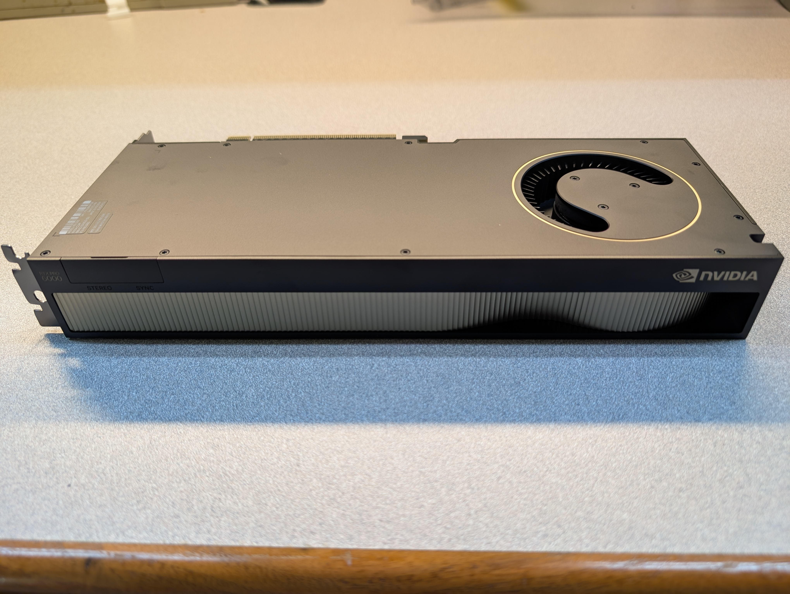
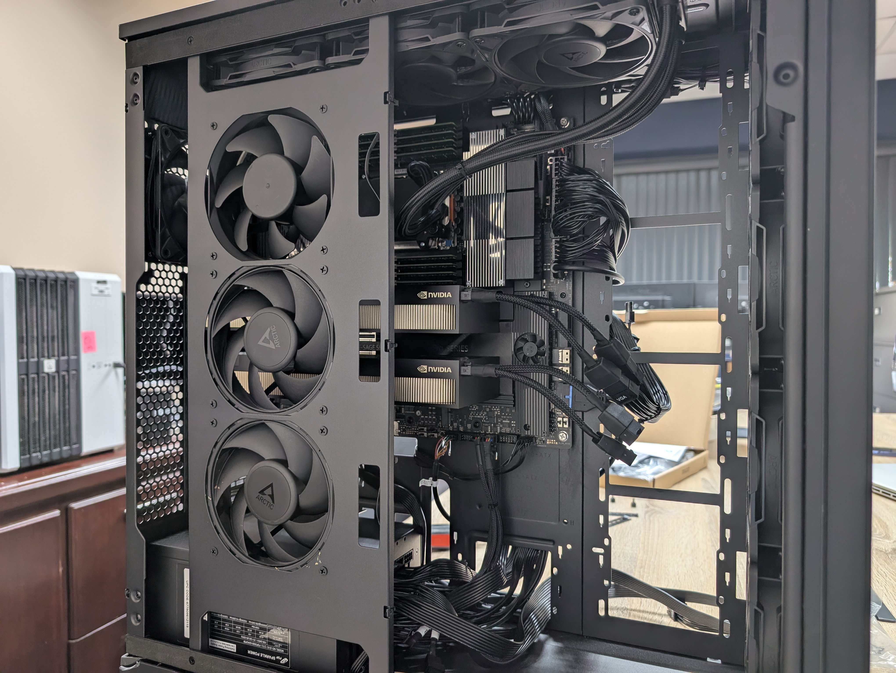
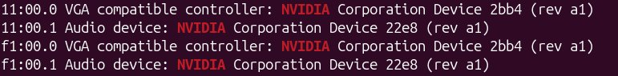
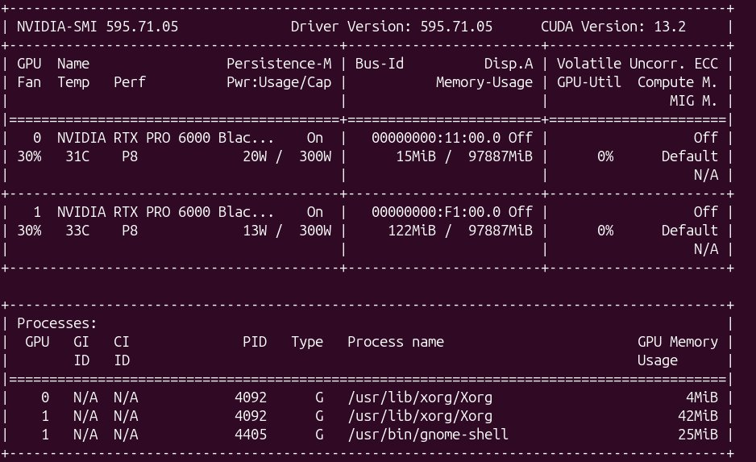

node01 just went from one NVIDIA RTX PRO 6000 Blackwell to two. The motivation was simple: a single 96GB card is plenty for shared inference and small-to-medium training jobs, but it can't run true multi-GPU parallel training. With model sizes creeping up, we needed a second card so people can actually spread a training job across GPUs instead of being capped at one.

{/* truncate */}

## Why We Needed This

node01's single RTX PRO 6000 Blackwell has been carved into 8 SLURM shards so multiple users can share it for inference and lighter workloads. That works well for shared use, but it means nobody could request more than one full GPU at a time — there simply wasn't a second one to allocate. For data-parallel or model-parallel training runs, that's a hard ceiling. Adding a second, identical card removes it: two GPUs now means jobs can actually use `--gres=gpu:2` and split work (or a model) across both.

## The Hardware

- **GPU**: NVIDIA RTX PRO 6000 Blackwell (PNY), ~96 GB VRAM
- **Now installed**: 2× identical cards on node01, ~192 GB VRAM combined
- **Host**: AMD Threadripper PRO 9985WX workstation (64 cores / 128 threads, 256 GB RAM)

The new card ships in a plain white PNY box — no surprises there. Inside is the card itself, NVIDIA reference design, with a "Remove Film Before Use" sticker over the fan shroud and the protective film still on.

It's a full-length, blower-style workstation card — for scale, that's a standard ballpoint pen sitting next to it. The rear edge shows the usual NVIDIA branding along with stereo and sync connectors, standard on this class of professional card:

## Installation

The Threadripper PRO motherboard has the PCIe lanes to spare, so the install itself was mechanically simple: open the case, pull the protective film off the new card, slot it into the second open x16 slot, and reconnect power. The case already has three intake fans up front feeding both GPUs, so no extra cooling changes were needed.

With the case open you can see both cards seated, power cables routed, and the existing AIO cooler tubing for the CPU running across the top.

## Verification

After buttoning the case back up and powering on, `lspci` confirms the OS sees both cards:

Both entries report the same device ID (`2bb4`), confirming they're identical RTX PRO 6000 Blackwell cards, each living on its own PCIe root (`11:00.0` and `f1:00.0`) — exactly what you'd want for two full-bandwidth GPUs rather than a bifurcated single slot.

`nvidia-smi` confirms the same from the driver's side, listing both as fully recognized RTX PRO 6000 Blackwell cards with their own 97.9 GB of VRAM each:

Both cards are idling at P8 with low power draw and no compute load, just the usual Xorg/gnome-shell overhead — exactly what you'd expect before any jobs are running.

## Next Up: Exposing the Second GPU to SLURM

The OS sees both cards, but SLURM doesn't yet — `gres.conf` and `slurm.conf` on node01 still only declare one. That's the next step:

- Add a second `Name=gpu Type=rtx6000 File=/dev/nvidia1` line to `gres.conf`
- Bump the node definition in `slurm.conf` to `Gres=gpu:rtx6000:2`
- Decide whether to also double the shard count (16 instead of 8) so shared inference workloads keep their current granularity alongside the new full-GPU parallel training option
- Restart `slurmctld` and `slurmd`, then verify with `scontrol show node node01` and a test job using `--gres=gpu:2`

I'll cover that config update in a follow-up post once it's done and tested.

## Worth It?

For shared inference and small jobs, nothing changes day to day — those still run fine on shards. But for anyone training larger models, this unlocks real multi-GPU parallelism on node01 for the first time. Once the SLURM config catches up, `--gres=gpu:2` should be ready to go.
