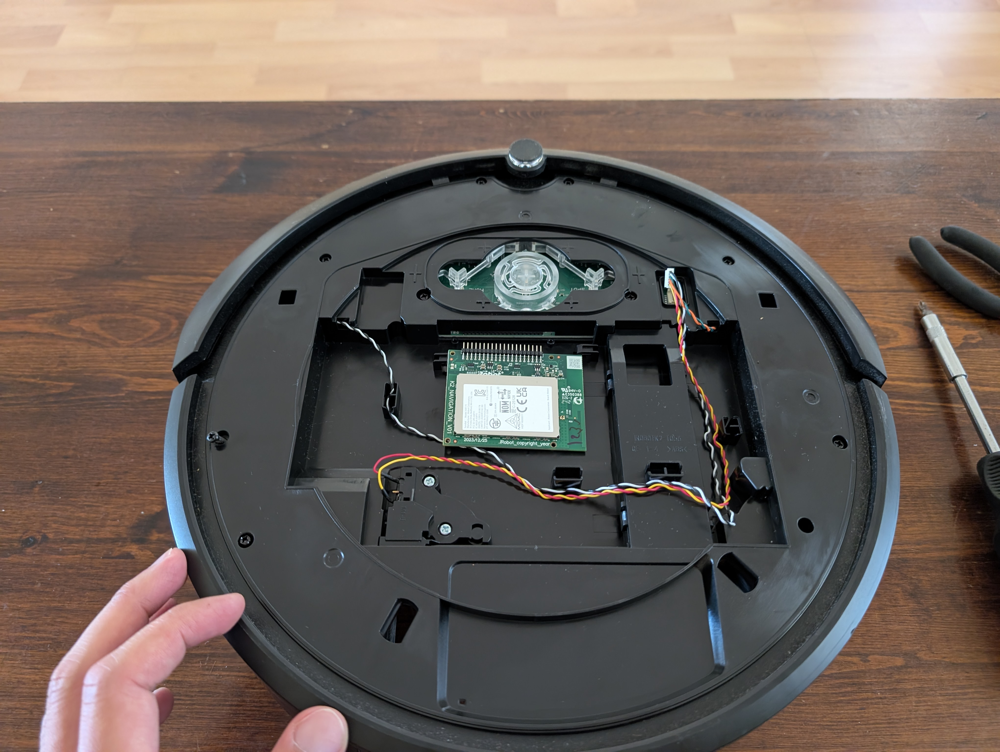
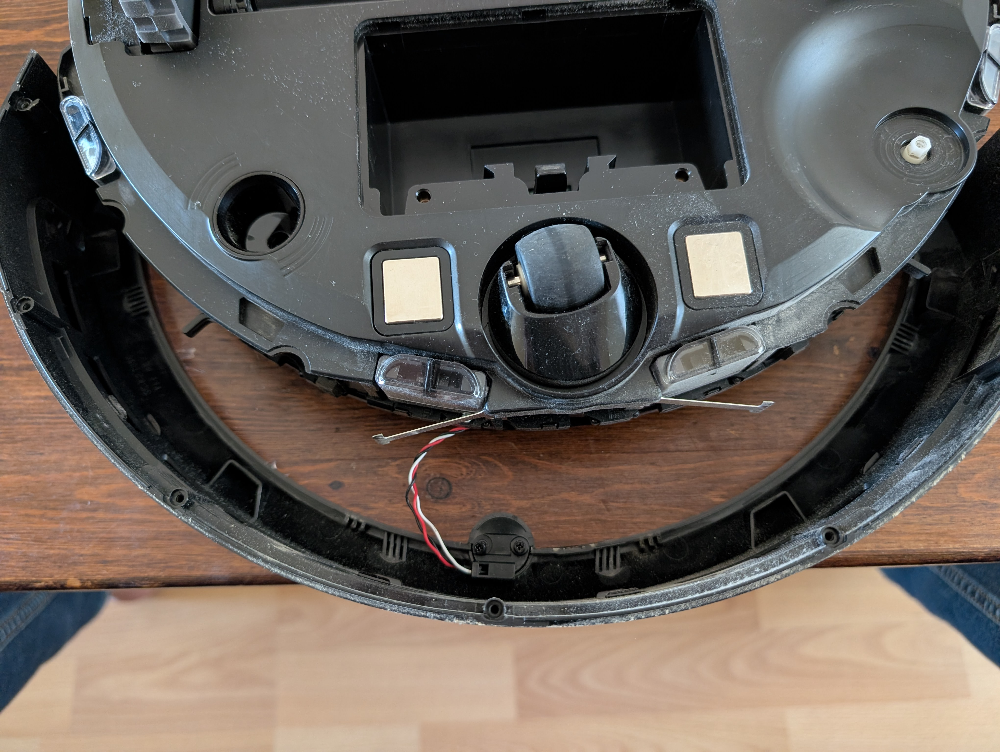
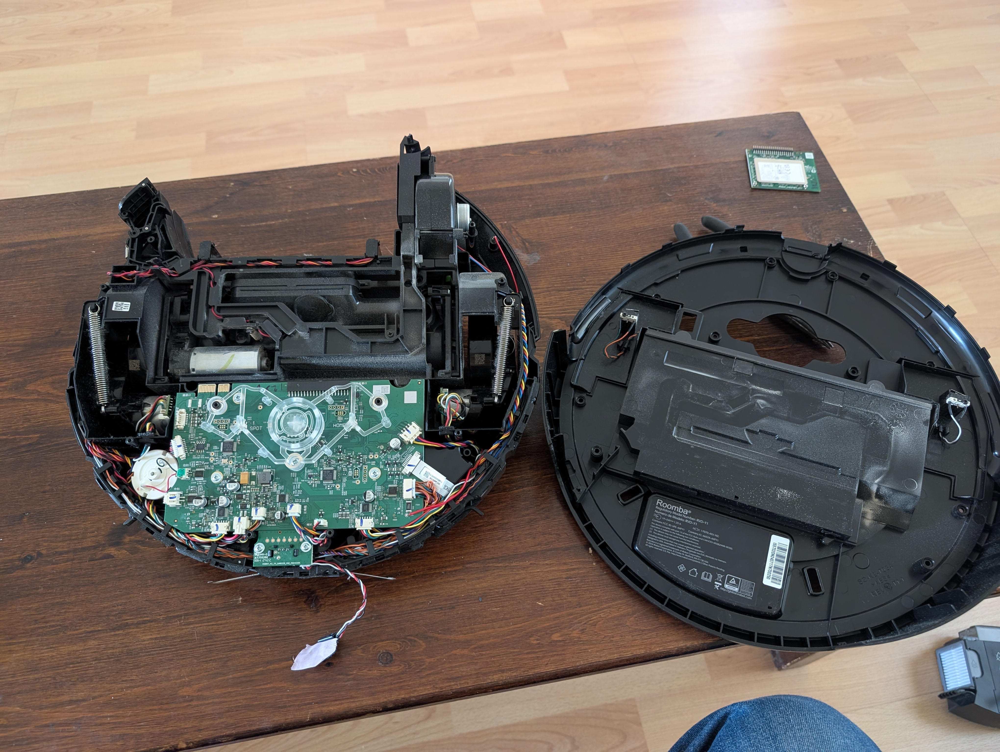
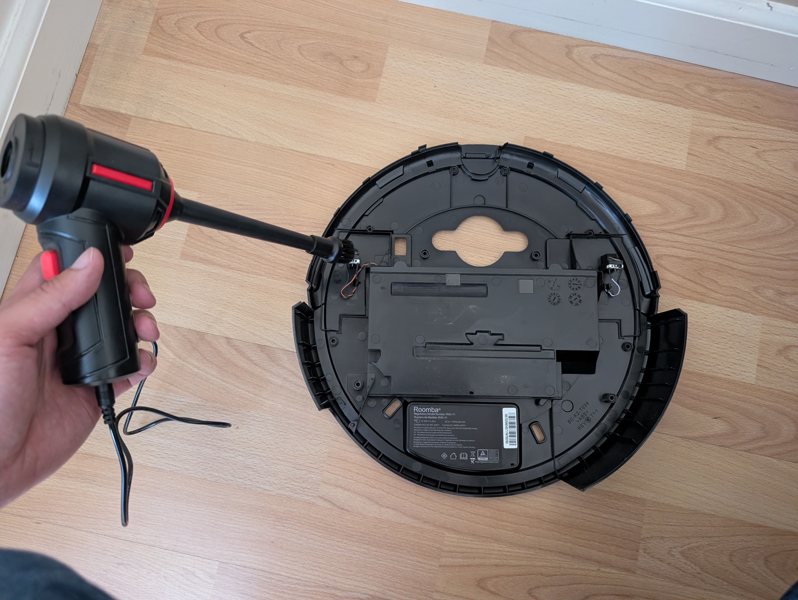
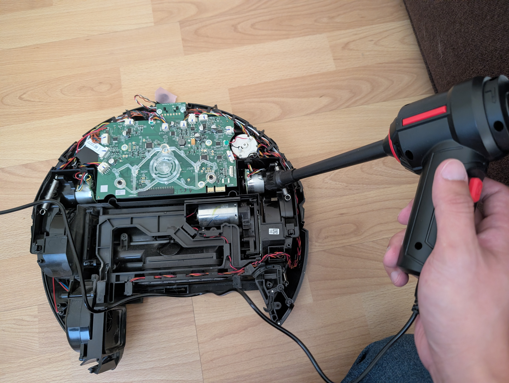
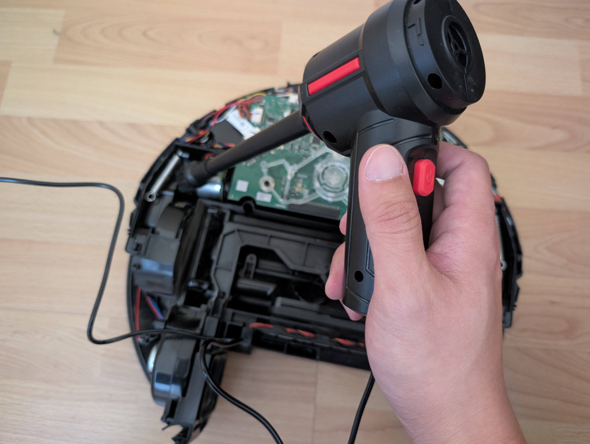
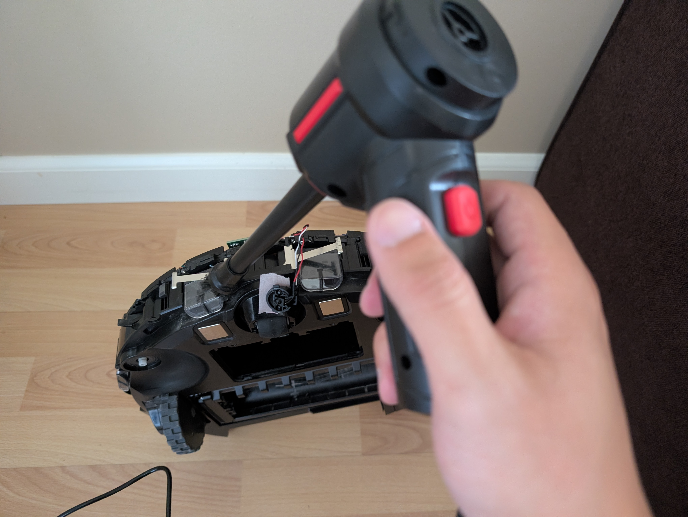
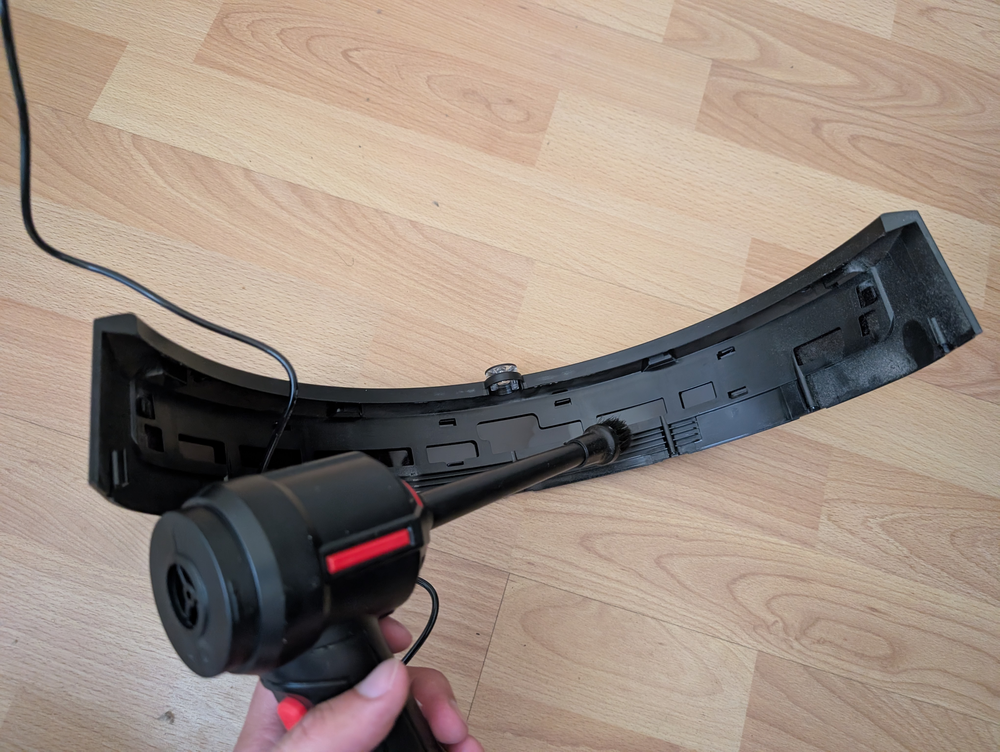
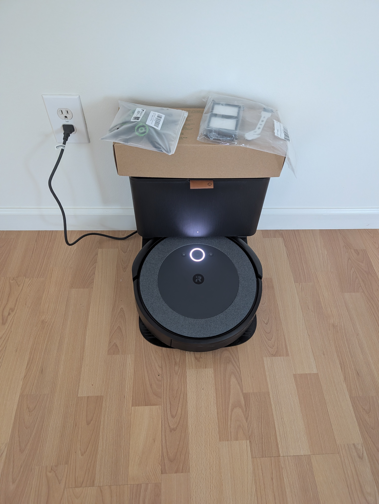

My Roomba i5 recently started jittering in place and spinning in tight circles instead of cleaning normally. A quick teardown and a can of compressed air later, it was back to driving straight.

{/* truncate */}

## The Symptom

Instead of navigating the room, the Roomba would twitch back and forth and spin in circles on the spot, almost as if one wheel thought it was stuck while the other wasn't. No error codes, no obvious mechanical jam — just erratic drive behavior.

## The Hypothesis

The i5's drive wheels are spring-loaded and ride on a suspension assembly with a small switch that tells the robot whether the wheel is drooped (hanging free, e.g. picked up or over a cliff) or loaded against the floor. If that switch gets clogged with dust and hair, it can misreport the wheel state intermittently — which would explain exactly this kind of stuttering, indecisive motion. My plan was to open the robot up and blow the dust out of the suspension switches and any other contact points along the drive train.

## Teardown

Removing the top cover exposes the wifi board and some wires right away.

*Top cover off — wifi board and wiring visible.*

Flipping to the back and remove the front bumper contact and cliff sensors right at the edge of the chassis.

*Front bumper contact and cliff sensors."

With the top and bottom shells fully separated, the whole drive train, main PCB, and vacuum motor assembly are exposed. I set the other parts side by side with the internals for reference while working.

*Fully separated: main chassis assembly on the left, outer shell and bin on the right.*

## Blowing Out the Dust

With everything opened up, I went over every switch, contact, and crevice with a compressed air blower — starting with the top shell around the wheel wells.

*Blowing out the wheel suspension switch contacts on the top shell.*

Then the main board and the motor housings, where dust tends to settle around connectors and moving parts.

*Clearing dust from the main board and motor housing.*

*Getting into the connector rows along the main board edge.*

The front edge and cliff sensors need the same treatment.

*Front edge switches, cleared of accumulated dust.*

Finally, the bumper edge and its contact switches, which see the most contact with debris during normal cleaning runs.

*Bumper edge switches — another common spot for dust buildup.*

## Reassembly and Result

After putting everything back together, I also swapped in a fresh set of filters and a new bag before setting the robot back on its dock to charge and re-map.

*Back together, filters and bag replaced, charging and ready for a test run.*

  <iframe
    src="https://www.youtube.com/embed/5orAMIcPjEo"
    title="Roomba i5 Driving Normally After Deep Clean"
    style={{position: 'absolute', top: 0, left: 0, width: '100%', height: '100%', border: 0}}
    allow="accelerometer; autoplay; clipboard-write; encrypted-media; gyroscope; picture-in-picture"
    allowFullScreen
  />

The jittering and spin-in-place behavior is gone — the robot drives and navigates normally again. The suspension switch dust buildup was a reasonable hunch that turned out to be right, though I didn't isolate the exact switch as the sole culprit; a full clean of every contact along the drive train made it hard to tell which one specifically was misbehaving. Either way, the fix is the same: a periodic teardown and compressed-air pass through the wheel switches, cliff sensors, and bumper contacts seems like cheap, worthwhile preventive maintenance for these robots.
