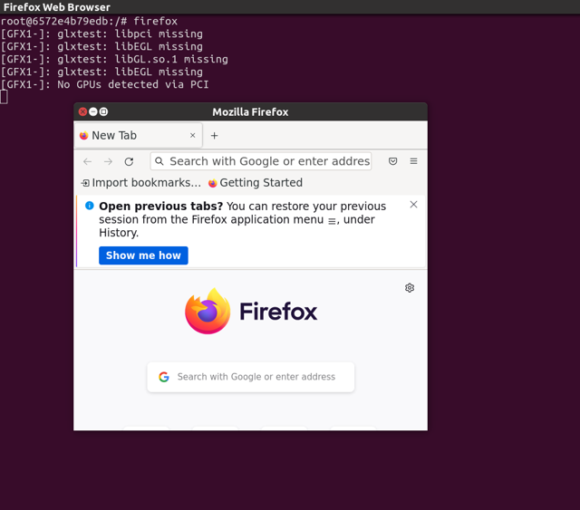

# Docker Container GUI Display

Docker is typically used for containerized applications and development. However, it is fully capable of running GUI applications as well. This guide demonstrates how to run a GUI application from a Docker container using a Firefox example.

## How It Works

The key is to pass two flags to `docker run`:

- `-e DISPLAY=$DISPLAY` — forwards the host display environment variable into the container
- `-v /tmp/.X11-unix:/tmp/.X11-unix` — mounts the X11 socket so the container can communicate with the host display server

You also need to allow X clients from any host (including the container) by running `xhost +` before launching the container.

## Example: Firefox

### 1. Create the Dockerfile

```dockerfile
FROM ubuntu:26.04

ENV DEBIAN_FRONTEND noninteractive

RUN apt-get update
RUN apt-get -y install \
    firefox \
    libcanberra-gtk-module \
    libcanberra-gtk3-module
RUN apt-get clean
```

:::note
The `libcanberra-gtk` libraries are optional but recommended. Without them, warnings may appear when launching GUI apps.
:::

### 2. Build the Docker image

```bash
docker build -f Dockerfile -t firefox:0.0.1 .
```

### 3. Run the container

```bash
xhost +
docker run -it --rm --privileged \
    -e DISPLAY=$DISPLAY \
    -v /tmp/.X11-unix:/tmp/.X11-unix \
    firefox:0.0.1
```

Once inside the container, launch Firefox:

```bash
firefox
```



### 4. Restrict access when done

After exiting the container, restore X access control to host-only:

```bash
xhost -
```

:::warning
Don't forget to run `xhost -` after you're done. `xhost +` grants X server access to everyone on the network, which is a security risk if left open.
:::

:::tip
For more advanced X11 forwarding setups — including GPU-accelerated GUI applications like RViz, CARLA, or Gazebo — see the [Docker Usage](../../hpc/user/docker.md) guide.
:::
